# 爱上 VNote——软件使用流水账

孙建虎 2018-07-17 Rev 2018-08-14

## 从相识到相爱

最初尝鲜 Markdown 并不是因为对 Markdown 有多么深入的了解，仅仅是出于不断尝试新事物的需要。后来，频繁使用 Markdown 编写图文混排教程，感觉很方便，渐渐爱上了 Markdown，不能自拔。

最近，自已一直在用的并且也推荐给他人使用的一款 Markdown 编辑器明确为收费软件了，于是，我就为自己进行了一场 Markdown 编辑器的海选，如下图[^1]所示。

[^1]: 文中软件截图使用 [Snipaste](https://zh.snipaste.com/download.html)（与 VNote 一样优秀的国产截图、贴图和标注软件）；图片后期处理使用了 [paint.net](https://www.getpaint.net/redirect/main_hm.html)；本文编辑使用 VNote。

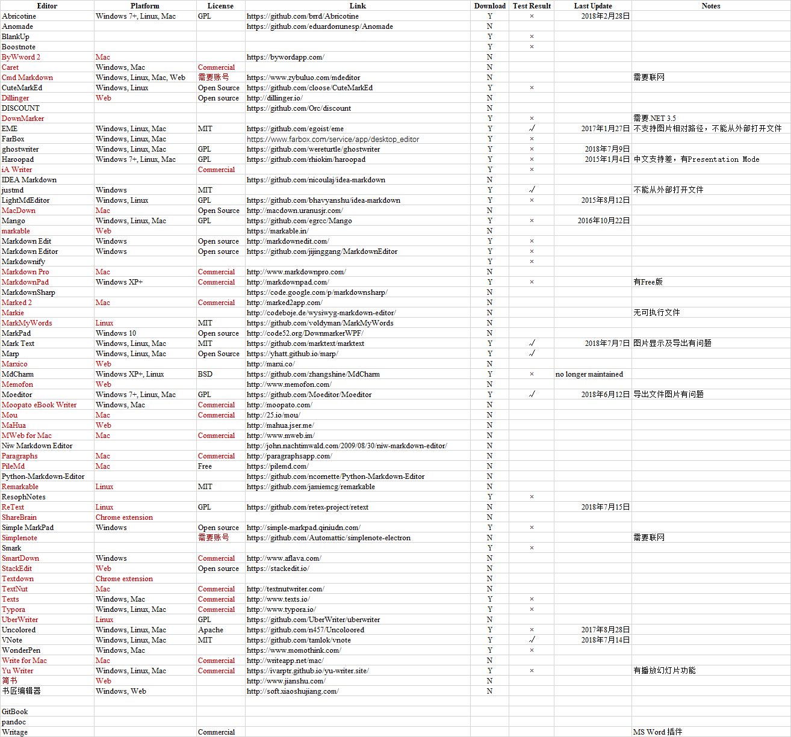

说来也是缘分，刚看到 VNote 时，扁平化的设计、小清新的风格让我眼前一亮（我是颜控），但第一次启动软件的时候，竟然要我设置路径，心想：至于么，我就是要个 Markdown 编辑器而已，遂转身离开。


几天的海选，不断搜索、下载、试用、比较，始终没有完全合意的。突然又想起了那个高颜值的 VNote（从某种程度上说，颜值也是生产力啊），没有真正试用就放弃了实在心有不甘，于是摒弃浮躁的心态，静下心来与 VNote 相处，越处越爱，越觉着离不开 VNote 了，每天摸索一下，小惊喜不断。相信你也一定会像我一样认同 VNote 的设计理念，爱屋及乌，VNote 粉也许会透过 VNote 仰慕软件作者吧。

经历各种折腾，查资料、尝试，基本上与 VNote 初步磨合好了，这也是负责任的我推荐 VNote 给他人使用之前的必做功课，并且，我要写一个小教程，目的就是让他人不至于在开始阶段因为不了解 VNote、误解 VNote 或者受到一点小小挫折就愤然离去，错失与一款杰出的 Markdown 编辑器——VNote 相爱的机会（其实远不仅仅是一款编辑器）。

## 下载并安装 VNote 1.19

**注意**：现在已经是 1.21 版本了，建议下载使用最新版本。后文也有我一步步从 1.19 版升级到 1.20 版，再到 1.21 版的流水账。

我使用 Markdown 有很长一段时间了，所以是有 Markdown 语法基础的（其实语法很简单）；理工科出身，有处理图表和公式的需要；使用环境为没有互联网连接的中文 Windows 10 x64 系统。目标读者假定和我类似，其他读者权当参考吧。接下来就随我简单认识下 VNote，希望这能让你能与 VNote 相爱得更简单些。

本文以 VNote 导出的 Markdown 文档格式提供，建议在 VNote 编辑模式（或者阅读模式）下阅读。

VNote 是采用 MIT License 的开源软件，官网为 https://github.com/tamlok/vnote ，可以在 https://github.com/tamlok/vnote/releases 下载软件，Windows 版的 VNote 软件为便携版（Portable），1.19 版有 2 个可供下载文件：

* 64 位便携版：`VNote_win_X64_portable_1.19.zip`（本文选择下载此文件）
* 32 位便携版：`VNote_win_x86_portable_1.19.zip`

软件作者 `tamlok` 很贴心，还专为国内用户提供了百度网盘下载链接 http://pan.baidu.com/s/1jI5HROq 。

在 `D` 盘下新建 `MyVNote` 文件夹，将下载的 `VNote_win_X64_portable_1.19.zip` 文件解压到 `D:\MyVNote` 文件夹下（路径可以自选，不过后文相应路径也要对应修改）。


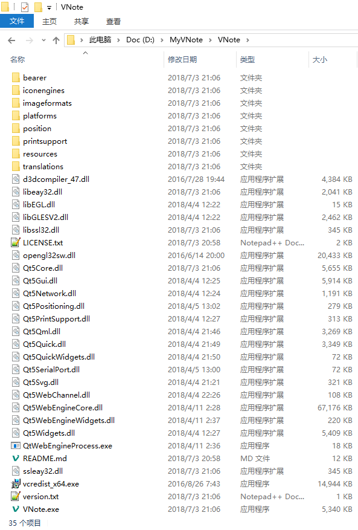

`D:\MyVNote\VNote\VNote.exe` 就是 VNote 软件的主程序，可以将其固定到任务栏或发送到桌面快捷方式，以方便之后快捷启动 VNote 软件，当然，我们也可以通过双击已有的 `*.md` 文件来打开 VNote 软件。

有 VNote 粉说 VNote 竟然不支持新建外部笔记，其实很简单，外部新建一个文本文档，修改后缀名为 `.md` 即可（虽然有点麻烦），并且 VNote 也可以导出笔记为独立文件。VNote 中称呼 `外部笔记` 为 `独立文件`，打开外部笔记时，软件界面右下角的位置有  标记，独立文件不能使用诸如 `标签`、`附件` 等功能，所以我还是强烈建议使用内部笔记，可以很方便地管理笔记，使用更多的特色功能。

### 文件关联 v1（不能使用）

设置 `*.md` 文件的默认打开方式为 VNote，这对于 Windows 用户来说应该很简单，这里提供一个通过导入注册表的方式进行快捷设置的方法，`注册表文件 v1` 内容如下：

```Registry
Windows Registry Editor Version 5.00

[HKEY_USERS\S-1-5-21-1862800926-2367917216-3330859151-500_Classes\Applications\VNote.exe\shell\open\command]
@="\"D:\\MyVNote\\VNote\\VNote.exe\" \"%1\""
```

### 文件关联 v2（应该可以）

重装系统之后发现，`注册表文件 v1` 不能成功导入，对比后发现，每个系统注册表中那串代码是不同的：

* 系统重装前为：1862800926-2367917216-3330859151
* 系统重装后为：2534397436-3503867807-444227408

对应修改之后可以成功导入注册表，但依然不能成功进行文件关联。几经折腾捣鼓出了 [注册表文件 v2](file/OpenWithVNote_v2.reg)，其内容如下：

```Registry
Windows Registry Editor Version 5.00
[HKEY_CLASSES_ROOT\.md]
[HKEY_CLASSES_ROOT\Applications\VNote.exe]
[HKEY_CLASSES_ROOT\Applications\VNote.exe\shell]
[HKEY_CLASSES_ROOT\Applications\VNote.exe\shell\open]
[HKEY_CLASSES_ROOT\Applications\VNote.exe\shell\open\command]
@="\"D:\\MyVNote\\VNote\\VNote.exe\" \"%1\""
```

## 首次启动 VNote

首次启动软件，在弹出的 `添加笔记本` 对话框中进行相关设置，单击 `确定` 按钮。

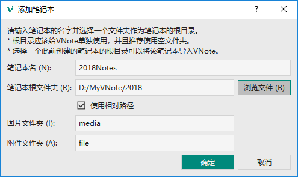

再在 `新建根文件夹` 对话框中进行设置，单击 `确定` 按钮。

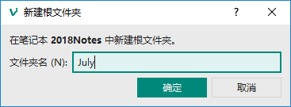

进入 VNote 软件界面。

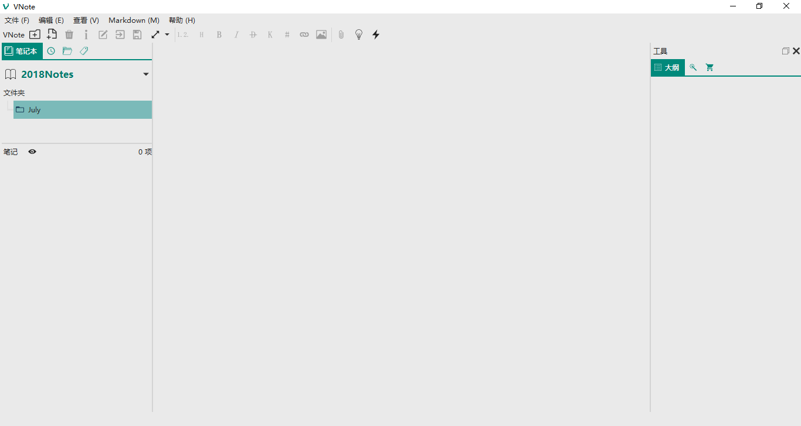

使用快捷键 `Ctrl+Alt+N` 新建笔记，在弹出的 `新建笔记` 对话框进行设置，单击 `确定` 按钮。

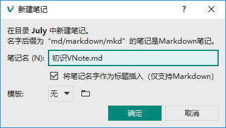

从下图所示软件界面中我们也可以看出 VNote 的文件系统遵循 `笔记本` > `文件夹` > `笔记` 的层次，可以很有逻辑地管理笔记。下图表示 `2018Notes` 笔记本下有个 `July` 文件夹，`July` 文件夹下有个 `初识VNote.md` 笔记。

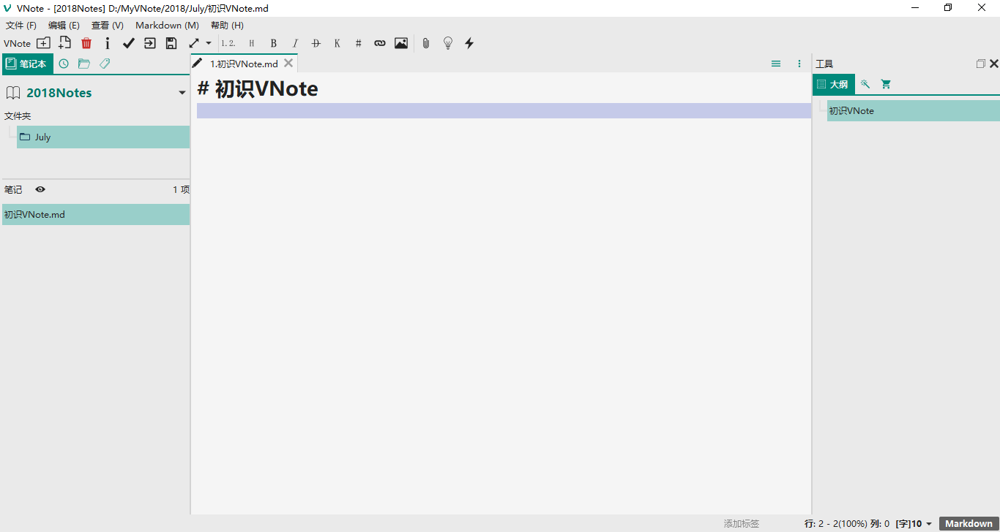

`D:\MyVNote` 文件夹下将自动新建一个 `2018` 文件夹，这个文件夹就用来存放笔记本名为 `2018Notes` 的相关文件，例如 `July` 文件夹。


在 `D:\MyVNote\2018` 文件夹下将自动建立 `July` 文件夹，用来存放其下的笔记，例如 `初识VNote.md`。


`D:\MyVNote\2018\July` 文件夹下将在首次插入图片和附件时分别自动建立 `media` 文件夹和 `file` 文件夹，用来存放图片和附件。这个设置契合我之前的使用习惯：为每个 Markdown 文档建立一个同级的 `media` 文件夹，用来存放文档中以相对路径方式插入的图片和链接文件。

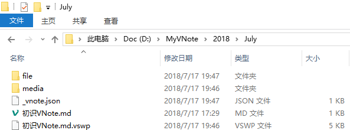

## 图表公式及导出的一些设置

对于 Markdown 的基本语法，无需赘述。虽然各种编辑器支持的语法各不相同，但总体说来差异不大。对于 VNote 软件，可以单击 `帮助` > `Markdown指南` 来快速回顾语法，了解 VNote 支持的语法，即使遇到以前没有接触过的语法，通过这个帮助也可以很快学会。

VNote 中的图表公式等一些功能通过调用第三方软件来实现，需要我们进行相关设置。

在 https://github.com/mathjax/MathJax/releases 下载 `MathJax`，将下载的 `MathJax-2.7.4.zip` 解压到 `D:\MyVNote\VNote\`，先记下 `D:\MyVNote\VNote\MathJax-2.7.4\MathJax.js?config=TeX-MML-AM_HTMLorMML`


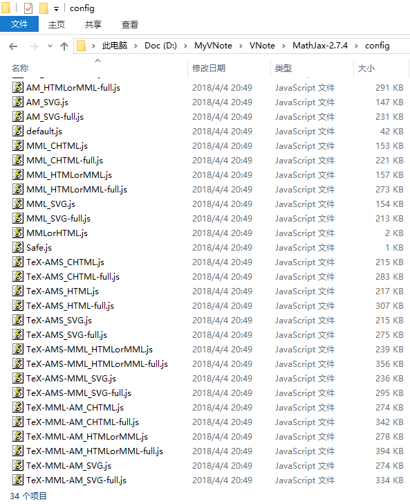

到 https://graphviz.gitlab.io/_pages/Download/Download_windows.html 下载 `Graphviz`，将下载的 `graphviz-2.38.zip` 解压到  `D:\MyVNote\VNote\`，记下 `D:\MyVNote\VNote\graphviz-2.38\bin\dot.exe`。


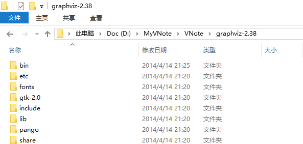

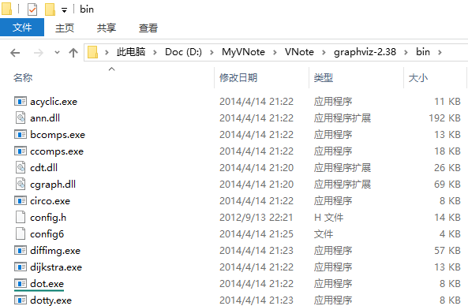

到 http://plantuml.com/download 下载 `PlantUML`，将下载的 `plantuml.1.2018.8.jar` 复制到  `D:\MyVNote\VNote\`，记下 `D:\MyVNote\VNote\plantuml.1.2018.8.jar`。


到 https://wkhtmltopdf.org/downloads.html 下载 `wkhtmltopdf`，双击下载的 `wkhtmltox-0.12.5-1.msvc2015-win64.exe` 进行默认安装，安装完毕后，将 `C:\Program Files\wkhtmltopdf\bin\wkhtmltopdf.exe` 复制到 `D:\MyVNote\VNote`，记下  `D:\MyVNote\VNote\wkhtmltopdf.exe`。


前述记下的信息：

* D:\MyVNote\VNote\MathJax-2.7.4\MathJax.js?config=TeX-MML-AM_HTMLorMML
* D:\MyVNote\VNote\graphviz-2.38\bin\dot.exe
* D:\MyVNote\VNote\plantuml.1.2018.8.jar

单击 `文件` > `设置`，弹出 `设置` 对话框。

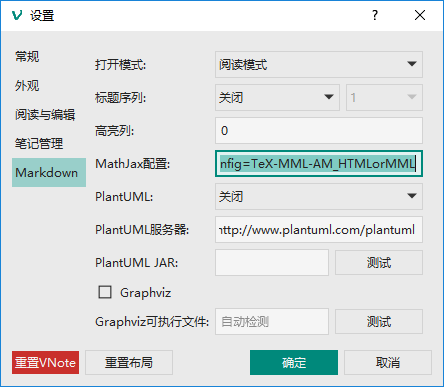

进行如下设置：

* MathJax 配置：将 `https://cdnjs.cloudflare.com/ajax/libs/mathjax/2.7.2/MathJax.js?config=TeX-MML-AM_HTMLorMML` 替换为 `D:\MyVNote\VNote\MathJax-2.7.4\MathJax.js?config=TeX-MML-AM_HTMLorMML`；
* PlantUML：选择本地JAR；
* PlantUML JAR：D:\MyVNote\VNote\plantuml.1.2018.8.jar
* 勾选 Graphviz
* Graphviz可执行文件：D:\MyVNote\VNote\graphviz-2.38\bin\dot.exe

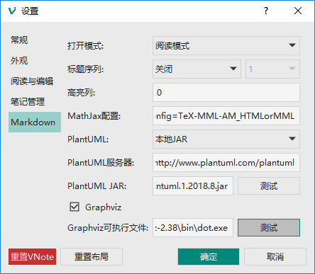

然后分别点击 `PlantUML JAR` 和 `Graphviz可执行文件` 后的 `测试` 按钮，测试成功后再单击 `确定` 按钮退出设置。


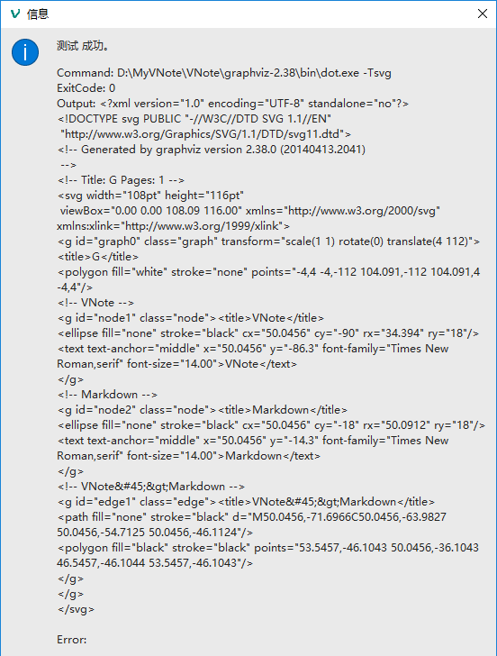

虽然 VNote 是便携软件，但软件运行后，系统内还是会有一些文件存在：

* C:\Users\\`usr`\AppData\Roaming\vnote（即 %AppData%\vnote，usr 指计算机用户名）
* C:\Users\\`usr`\AppData\Local\VNote（即 %LocalAppData%\VNote）

%AppData%\vnote\vnote.ini 是 VNote 的配置文件，其中保存了与软件有关的相关配置：


`vnote.ini` 是一个文本文件，文件末尾就保存有我们刚刚进行的设置信息：

```
[web]
mathjax_javascript="D:\\MyVNote\\VNote\\MathJax-2.7.4\\MathJax.js?config=TeX-MML-AM_HTMLorMML"
plantuml_jar=D:\\MyVNote\\VNote\\plantuml.1.2018.8.jar
graphviz_dot=D:\\MyVNote\\VNote\\graphviz-2.38\\bin\\dot.exe
```
所以刚刚的设置还有一个简单的方法，就是直接修改配置文件 `vnote.ini`，可以单击 `文件` > `打开配置文件夹`，使用文本编辑器（例如 Notepad++）编辑 `vnote.ini`。

单击 `Markdown` 菜单进行一些设置，勾选 `Mermaid图表 (M)`、`Flowchart.js`、`MathJax` 三项。


为了使设置生效，需要重启 VNote 软件，最好先保存打开的笔记，保存的快捷键为 `Ctrl+S`。

重新启动后，用下面的这些代码来看看图表和公式是否显示正常，正常就说明我们的设置没有问题了。

这是行内（Inline）公式 $a^2+b^2=c^2$，下面是行间（Display）公式：

```mathjax
$$
a^2+b^2=c^2
$$
```

VNote默认的渲染器 `markdown-it` 支持上下标（1.19 版时与数学公式有冲突，目前版本已修复）：我的<sup>上标</sup>我的<sub>下标</sub>。需要在 `Markdown` > `markdown-it选项` 的次级菜单中勾选 `上标` 和 `下标`，对应配置文件 `%AppData%\vnote\vnote.ini` 为：

```
[web]
markdownit_opt=sub, sup
```

这是借助 `Graphviz` 的 `dot` 语言绘制的一个图表：

```dot
digraph G {
Vnote -> 下载与安装
Vnote -> 首次启动及配置
Vnote -> 图表公式及配置
图表公式及配置 -> 公式
图表公式及配置 -> 图表
图表公式及配置 -> 表格
下载与安装 -> 结束
首次启动及配置 -> 结束
公式 -> 结束
图表 -> 结束
表格 -> 结束
}
```

下面是借助 PlantUML 绘制的图表：

```puml
VNote -> 公式 : MathJax
```

这是一个来自 VNote 帮助文件（软件菜单操作：`帮助` > `Mardown指南`）的表格：

| col 1 | col 2 | col 3 |
| --- | --- | --- |
| cell1 | cell2 | cell3 |
| cell4 | cell5 | cell6 |

VNote 也支持 `Flowchart.js` 和 `Mermaid` 来绘制图表。

这是一个来自 [VNote GitHub 主页](https://github.com/tamlok/vnote) 的一个例子：

```flow
st=>start: start
e=>end: end
cond=>condition: VNote
st->cond
cond(yes)->e
```

这是一个来自 VNote 帮助文件（软件菜单操作：`帮助` > `Mardown指南`）的一个例子：

```flowchart
st=>start: Start:>http://www.google.com[blank]
e=>end:>http://www.google.com
op1=>operation: My Operation
sub1=>subroutine: My Subroutine
cond=>condition: Yes
or No?:>http://www.google.com
io=>inputoutput: catch something...
 
st->op1->cond
cond(yes)->io->e
cond(no)->sub1(right)->op1
```

这是一个来自 [mermaid GitHub 主页](https://github.com/knsv/mermaid) 的一个例子：

```mermaid
sequenceDiagram
participant Alice
participant Bob
Alice->>John: Hello John, how are you?
loop Healthcheck
John->>John: Fight against hypochondria
end
Note right of John: Rational thoughts <br/>prevail...
John-->>Alice: Great!
John->>Bob: How about you?
Bob-->>John: Jolly good!
```

在编辑区域单击鼠标右键，有 `保存更改并阅读` 和 `图表实时预览` 功能可供使用。VNote 编辑和阅读的分离是一个很好的设计，使用快捷键 `Ctrl+T` 在 `编辑模式` 和 `阅读模式` 之间切换，显见的好处是，我再也不用担心阅读 Markdown 文档时因误操作而意外修改文档了。打开 Markdown 文档时是阅读模式还是编辑模式可以在 `设置` 中进行设置。

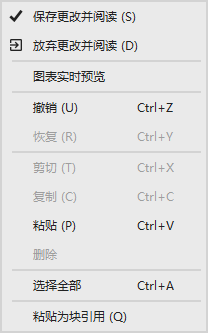

编辑好的笔记有时需要发给别人查看，单击 `文件` > `导出`。

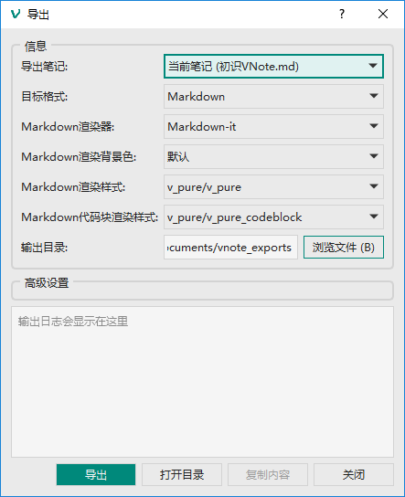

导出的目标格式有很多种可供选择。


目标格式中有 PDF(多合一)，此功能需要借助 `wkhtmltopdf` 实现。

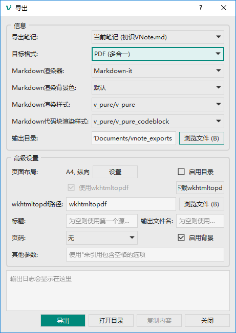

指定 `wkhtmltopdf路径` 为 `D:\MyVNote\VNote\wkhtmltopdf.exe`。

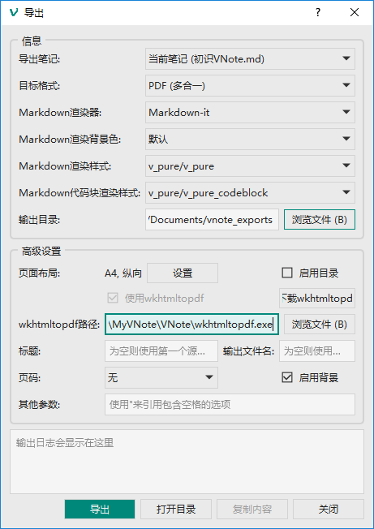

%AppData%\vnote\vnote.ini 是 VNote 的配置文件：


与前边的设置一样，此设置也可以通过直接修改配置文件 `%AppData%\vnote\vnote.ini`进行：

```
[export]
wkhtmltopdf=D:\\MyVNote\\VNote\\wkhtmltopdf.exe
```

## 给理工科同学的三个福利

图片标题：需要进行设置，`Markdown` > `启用图片标题`，这就很符合理工科的胃口了。

标题序列：用过 MS Word 的同学应该知道 `多级列表` 这个东西，标题序列就是类似的功能，开启很简单，编辑模式下，单击工具栏的 `标题序列` 按钮  即可，理工科的同学有福了。

暗黑主题：`文件` > `主题` > `v_detorte` 或者 `v_mooonlight`，软件作者说了：`v_detorte` 适合白天或有灯光时使用，`v_mooonlight` 适合夜里不开灯时使用。

## 升级到 1.20 版

保存笔记，关闭 VNote。如果 `文件` > `设置` > `常规` 下设置勾选了 `系统托盘`，即关闭 VNote 后最小化到系统托盘，则需要从系统托盘图标退出软件。也可以从 `任务管理器` 中关闭。

将 VNote 路径 `D:\MyVNote\VNote` 下除了 `graphviz-2.38`、`MathJax-2.7.4`、`plantuml.1.2018.9.jar`、`wkhtmltopdf.exe` 外的文件全部删除，将新下载 `VNote_win_X64_portable_1.20.zip` 解压到 `D:\MyVNote\VNote` 下，即 `VNote_win_X64_portable_1.20.zip\VNote` 下的文件复制到 `D:\MyVNote\VNote` 下。

用户文件（包括一些与软件相关的配置文件、样式文件、模板文件、主题文件、日志文件等）在 `%AppData%\vnote` 和 `%LocalAppData%\VNote` 路径下。用户笔记及配置文件在 `D:\MyVNote\2018` 路径下。

打开 VNote 使用 1.20 版。


## 备份与迁移

相关文件及其路径：

* 软件：D:\MyVNote\VNote
* 与软件设置有关的文件：%AppData%\vnote\vnote.ini
* 笔记：D:\MyVNote\2018
* 与笔记有关的文件：%AppData%\vnote\session.ini

如果是重装系统，D 盘一般不动，而 C 盘文件一般会被清除，则仅需要备份 %AppData%\vnote\vnote.ini 和 %AppData%\vnote\session.ini 两个文件，其中 session.ini 文件中 `[history]` 和 `[geometry]` 两部分可以删除掉，其中最关键的是 `[notebooks]` 部分。

如果是迁移到其他计算机，则 D:\MyVNote 复制到目标计算机 D:\，%AppData%\vnote\vnote.ini 和 %AppData%\vnote\session.ini 复制到目标计算机 %AppData%\vnote\，如果路径不存在，则自行创建路径。

或者，还有一种方法更为实用，将 vnote.ini 和 session.ini 移动到 D:\MyVNote\VNote 路径下（与 VNote.exe 同路径），则 VNote 便不会再创建 %AppData%\vnote 路径并在这里存放配置文件了，但 %LocalAppData%\VNote 路径依然还在（文件夹下有 cache 和 QtWebEngine 两个文件夹），原先在 %AppData%\vnote 路径下的相关文件（snippets（存放片段，可以备份）、styles、templates、themes、session.ini、vnote.ini、vnote.log）直接存放于 D:\MyVNote\VNote 路径下，这样软件和笔记更加便携了。

## 升级到 1.21 版

保存笔记，关闭 VNote。如果 `文件` > `设置` > `常规` 下设置勾选了 `系统托盘`，即关闭 VNote 后最小化到系统托盘，则需要从系统托盘图标退出软件。也可以从 `任务管理器` 中关闭。

将 VNote 路径 `D:\MyVNote\VNote` 下除了 `graphviz-2.38`、`MathJax-2.7.4`、`snippets`、`styles`、`templates`、`themes`、`plantuml.1.2018.9.jar`、`session.ini`、`vnote.ini`、`vnote.log`、`wkhtmltopdf.exe` 外的文件全部删除，将新下载 `VNote_win_X64_portable_1.21.zip` 解压到 `D:\MyVNote\VNote` 下，即 `VNote_win_X64_portable_1.21.zip\VNote` 下的文件复制到 `D:\MyVNote\VNote` 下。

用户文件（包括一些与软件相关的配置文件、样式文件、模板文件、主题文件、日志文件等）在 `%AppData%\vnote` 和 `%LocalAppData%\VNote` 路径下。用户笔记及配置文件在 `D:\MyVNote\2018` 路径下。

由于 `%AppData%\vnote` 路径下的文件夹和文件 snippets、styles、templates、themes、session.ini、vnote.ini、vnote.log 已经在上次升级到 1.20 版后移动到 `D:\MyVNote\VNote` 路径下，所以无需理会。

`%LocalAppData%\VNote` 路径下的文件目前还不清楚有什么用途，暂不理会。

`D:\MyVNote\2018` 路径下的文件没有任何修改，也无需理会。

打开 VNote 使用 <mark>1.21 版</mark>。`文件` > `设置` > `重置布局` > `确定` > `确定` > 重启 VNote。

## 收尾

本文不是一个让你全面了解 VNote 的系统教程，而是为了扫清你与 VNote 相爱的初步障碍。也许在之后的使用中你还会遇到小困难，或者你想系统学习 VNote，那么下面的资料会有帮助：

* 软件[官网](https://github.com/tamlok/vnote)及自带帮助
* 英文文档 http://vnote.readthedocs.io/
* 中文文档 http://vnote.readthedocs.io/zh_CN/latest/
* 微信公众号 `VNote笔记`

常到[官网](https://github.com/tamlok/vnote)转转，官网上有打赏软件作者的渠道，也可以提交 Bug、Request 新功能、参与开发、提交反馈等。赶快向亲朋好友推荐使用 VNote，做个义务讲解员，带他们入门吧！

最后，向 VNote 作者 `tamlok` 致敬!